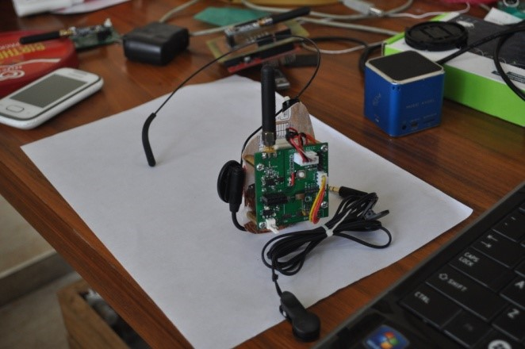
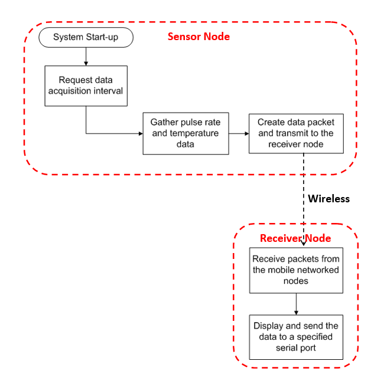
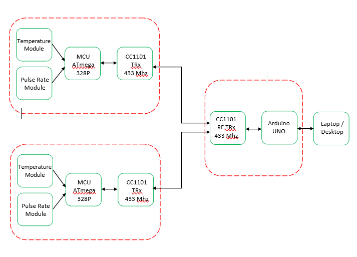
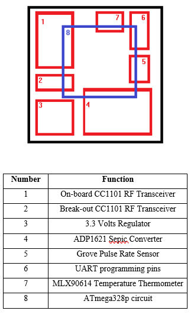
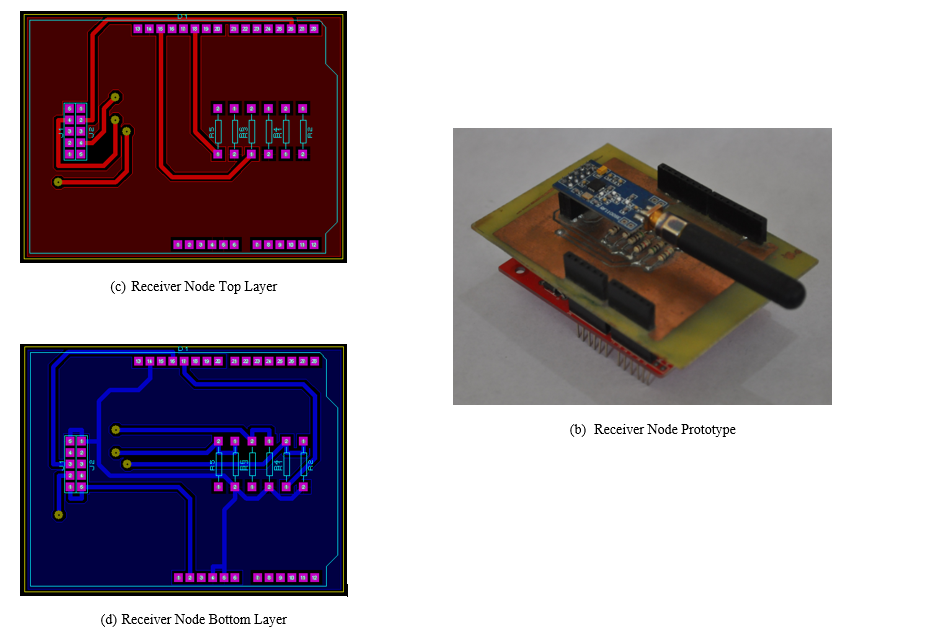

# Wireless Data Logging Platform for Human Temperature and Pulse Rate with Networked Mobile Nodes

This is an undergraduate thesis made by Anthony E. Raterta as a requirement for the Degree Bachelor of Science in Electronics and Communications Engineering. 

## Objectives

Generally, the main objective of this study is to construct a prototype of a wireless multi-node data logger that has mobile sensor nodes using transceivers that communicate in the ISM band.

The following are the specific objectives of this study:

1.	To construct a wearable data logger platform.
2.	To utilize the CC1101 transceiver chips for communication.
3.	To attach a temperature and pulse rate sensor in the data logger platform for monitoring human body temperature and pulse rate. 
4.	To identify a suitable location for human body temperature and pulse rate monitoring.

## Methods 

### Flow

The operation of the system imposed is shown in the image below. It contains simplified illustration of the two major parts, the mobile sensor node which may be of any number but for the study, the researcher only made two nodes. The other major part of the system is the receiver node which receives the packets sent by both sensor nodes and dummy nodes.

### Block Diagram

Shown in the image below is the physical architecture of the system designed to gather temperature and pulse rate of a patient at an interval set. A single sensor node is composed of an MLX90614 infrared thermometer and an infrared based Grove ear-clip pulse rate sensor.  These modules serve as input devices to an ATmega328p microcontroller unit with a CC1101 RF transceiver working at 433 mega hertz frequency band connected into it and to have the data gathered transmitted into the receiver node which is composed of a CC1101 RF transceiver, an Arduino UNO and a personal computer or a laptop. The microcontroller unit serves as a bridge to have the gathered data stored into the PC or the database pool.

### Materials:

1. MCU - For the device, a programmable ATmega328p microcontroller will be used to do the tasks set. The circuit of an Arduino UNO will be used since its circuit is free and its programming IDE is open source. Also, several supports and forums are available online which would be a great help for the study and could minimize the period of the over-all development process. However, some parts of the Arduino UNO are not usable for the hardware design and may be deemed unnecessary so these parts will be disregarded. Also, the ATmega328p working at 3.3 volts  in the Arduino UNO can also be set to use its internal 8 MHz clock which could be a great option in the aim of minimizing the size of the output device.

2. MLX90614 Infrared Thermometer - A non-contact MLX90614 Infrared Thermometer working at voltage range of 2.4 – 3.6 volts will be used for the sensor node to gather temperature in degrees Celsius (°C). MLX90614 is best in medical usage with an accuracy of 0.5 degrees Celsius (°C).

3. Grove Ear-Clip Heart Pulse Sensor - The Grove ear-clip pulse sensor is an infrared based sensor that could detect the changes in the density of blood due to the occurrence of pulse during blood circulations. By determining the time interval of the changes of the blood density in the ear lobe, the sensor can have an accurate value of pulse rate.

4. CC1101 RF Transceiver - To maximize the mobility of the sensor node, the transmission of the data gathered from the sensors can be sent wirelessly depending on the choice of media. The effective transmission range for such media should also be maximized so that a bigger scope of a network will be made without jeopardizing the aim of minimizing the power consumption of each component used in the device. To cater such considerations, a CC1101 RF transceiver operating at 433 MHz was used. The said transceiver is capable of naming each node with a specific unique address which is beneficial for the study. A CC1101 RF transceiver break-out module will be used in the early development of the device for testing and debugging purposes. 

5. Power Supply - The devices uses the ADP1621 SEPIC Converter which supplies a constant 3.3 volts output despite the diminishing value of input voltage ranging from 5 – 3 volts. Such circuit is ideal for mobile data loggers because of its capability of regulating and boosting input voltages.

6. Power Source - Since the main power supply needed for the device needs input voltage ranging from 3 to 5 volts, a mobile phone battery is a good option for such application. 

## Device

### PCB Layout Plan

### PCB Layout vs Actual

###### Mobile Node

###### Receiver Node

